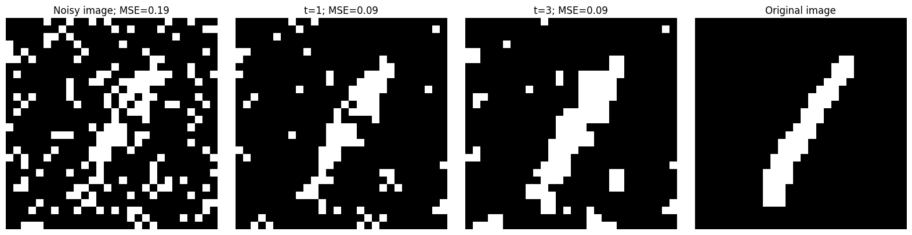
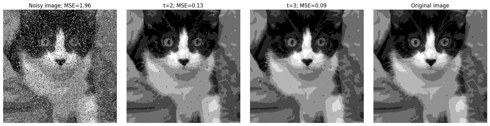

# Instructions

There are 20 points possible for this assignment. The setup is worth 1 point,
the coding is worth 11 points, and the free-response questions are worth 8
points. The deadline for this assignment is posted on Canvas. Please read this
and the entire README before beginning the assignment.

## Setup (1 point)

The setup for this assignment requires you to pass the `test_setup` cases.  To
do so, all you need to do is put your (and your partner's) NetID(s) in the
`netid` file and push that change to GitHub.

## Coding (11 points)

Before you get started with the code, you will need to download the data.
Follow the instructions in `data/README.md`.

You need to write code in every function in `src/` that raises a
`NotImplementedError` exception. Your code is graded automatically using the
test cases in `tests/`.  To see what your grade is going to be, you can run
`python -m pytest`; make sure you have installed the packages from
`requirements.txt` first. If the autograder says you get 100/100, it means you
get all 11 points.

The tests build on and sometimes depend on each other. **We suggest that you
implement them in the order they appear in `tests/rubric.json`.** That file
also allows you to see how many points each test is worth and which other
tests it may depend on. 

## Free-response questions (8 points)

Your free-response questions should be uploaded to Canvas as four separate PDF
files, named `qX.pdf` where `X` is the number of the question you are
answering. Don't worry if Canvas automatically renames a reuploaded file (e.g.,
`q4-2.pdf` if you update your answer to question 4), but make sure that the
first integer in the filename is the number of the question you're answering.

### Q1: Variational inference (1 point) 

An alternate approach to approximate inference in arbitrary graphical models is
variational inference, such as a Mean Field approximation. If you were to
implement this in the image denoising setting, you would also want to use the
`get_neighbors` function from `src/utils.py`.  What else would you have to
change to implement a variational inference approximation to the $p(Z | X)$
distribution? You can describe this conceptually or with pseudocode.

### Q2: MNIST image borders (1 point)

Depending on your implementation and hyperparameters, you might notice that
while your code does a decent job overall denoising the MNIST images, there are
often some white splotches around the edges. For example, if I run:

```
python -m free_response.explore --data mnist --img 3 \
    --n_colors 2 --noise 0.2 \
    --n_gibbs_iters 5 --n_em_iters 3 --burnin 2
```

I get this output:



At some level, this seems like it should be easy to fix, as MNIST images are
very unlikely to have white pixels near the border. How might you change the
graphical model we're using to denoise these images to take into account that
the image borders are very likely black? How would this change the algorithms,
learned parameters, and/or hyperparameters we're using?

### Q3: Exploration #1 (3 points)

You should conduct an analysis of your code's ability to denoise images and
write it up as a 1-2 page PDF. You should not include Python code in your
writeup, but please make it clear what experiments you ran.

Your analysis will be graded out of three points:
- 1 point for a convincing description of a meaningful trend you explored
- 1 point for connecting that trend back to the course materials or other
  sources
- 1 point for the effort and creativity your analysis demonstrates.

This is an opportunity for you to run some experiments and explore the behavior
of the Gibbs sampling and EM algorithms. The test cases haven't done much to
explore how the various hyperparameters (e.g., `J`, `n_gibbs_iters`, etc.)
affect how well we can denoise images.  You can and should use
`free_response/explore.py` as an entry-point into your experiments.  You can
run that from the root directory of your repo with `python -m
free_response.explore`, followed by the command-line arguments you want to
include. You can look at the code to see how those arguments are parsed. For
example, you could run:

```
python -m free_response.explore --data cats --img 3 \
    --n_colors 8 --noise 0.2 \
    --n_gibbs_iters 5 --n_em_iters 3 --burnin 2
```

With my code on my laptop, that takes about one minute to run and results in a
figure that looks like this:



You can but do not have to try to do whatever you can to minimize the MSE of
your final reconstruction. You should prioritize a *meaningful* trend; if
varying `beta` in small increments from 1 to 2 has no effect on your image
denoising, then that's not a meaningful trend.

You can explore MNIST and/or cat images, but many trends will be more
interesting with the larger cat images. However, the cat images are also larger
and so the algorithms will take longer.

You are welcome to explore changes that depend on more complex code changes or
multiple hyperparameters. For example, there may be some choices you made in
your `em.py` or `gibbs.py` implementations that could pass the tests either way,
but might perform better or worse on cat or MNIST data.

If there's an exploration you want to pursue that your unsure of, you can ask
for feedback on it. Please ask at least one week before the posted deadline.

### Q4: Exploration #2 (3 points)

Conduct a second exploration of a different trend, following the same
instructions as for Q3. Turn this writeup in as a separate 1-2 page PDF titled
`q4.pdf`.
